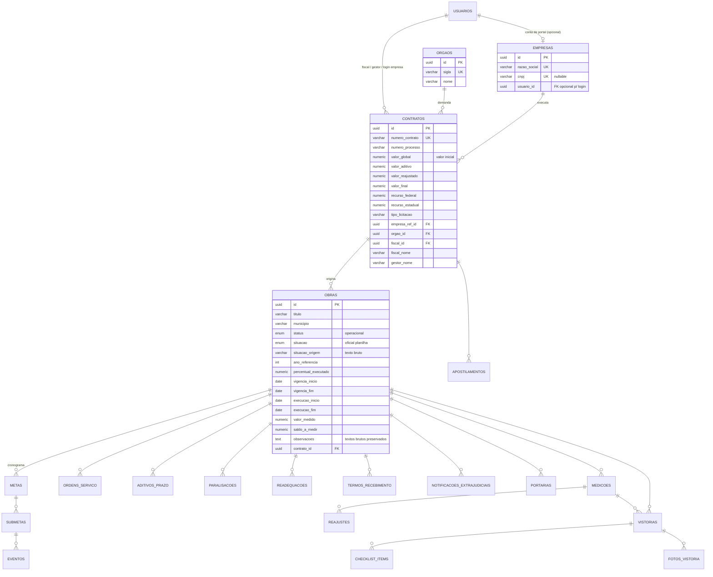

# SIN-Obras — Novo Modelo de Dados (DER Conceitual + Modelo Lógico)

> **Data:** 18 de junho de 2026
> **Escopo:** Restruturação do núcleo de cadastro/contratos/obras e normalização
> dos dados oficiais da planilha `Acompanhamento de obras.xlsx`.
> **Scripts SQL completos:** ver [`schema-novo.sql`](./schema-novo.sql) (DDL real, gerado via `pg_dump`).

---

## 1. Resumo das mudanças

| Mudança | Tipo | Justificativa |
|---|---|---|
| Tabela `empresas` | **Nova** | A coluna EMPRESA da planilha (277 razões sociais) era texto livre. Vira entidade própria, deduplicada, separada de `usuarios` (nem toda empresa loga no portal). |
| Tabela `orgaos` | **Nova** | A coluna ÓRGÃO (42 siglas: SEEC, SESAP, DER…) era texto livre. Vira tabela de domínio com FK. |
| Enum `situacao_obra_enum` | **Novo** | As 43 variações de texto da coluna "SITUAÇÃO DA OBRA" foram consolidadas em 9 estados canônicos. |
| `contratos` (+14 colunas) | **Alterada** | Financeiro completo (aditivo, reajuste, recursos fed/est), licitação, FKs normalizadas (empresa/órgão/fiscal). |
| `obras` (+18 colunas) | **Alterada** | Prazos rastreáveis (vigência/execução), situação oficial, textos brutos preservados. |
| `contratos.empresa_id`, `data_assinatura`, `data_vigencia` | **Relaxadas** p/ NULL | Dados históricos nem sempre têm esses campos preenchidos. |

As 9 tabelas de acompanhamento (`ordens_servico`, `aditivos_prazo`, `paralisacoes`,
`readequacoes`, `apostilamentos`, `reajustes`, `termos_recebimento`,
`notificacoes_extrajudiciais`, `portarias`) já haviam sido criadas em etapa
anterior (migration `ff6285b72f48`) e permanecem para uso operacional do app
daqui em diante.

---

## 2. DER Conceitual (núcleo restruturado)

---

## 3. Modelo Lógico — tabelas novas e alteradas

### 3.1. `empresas` (nova)

| Coluna | Tipo | Constraints |
|---|---|---|
| `id` | UUID | PK |
| `razao_social` | VARCHAR(300) | UNIQUE, NOT NULL, INDEX |
| `cnpj` | VARCHAR(18) | UNIQUE, NULLABLE |
| `usuario_id` | UUID | NULLABLE — conta de login no portal, quando existir |
| `criado_em` | TIMESTAMPTZ | NOT NULL |

### 3.2. `orgaos` (nova)

| Coluna | Tipo | Constraints |
|---|---|---|
| `id` | UUID | PK |
| `sigla` | VARCHAR(40) | UNIQUE, NOT NULL, INDEX |
| `nome` | VARCHAR(200) | NULLABLE — nome por extenso (a complementar) |
| `criado_em` | TIMESTAMPTZ | NOT NULL |

### 3.3. `contratos` (colunas adicionadas)

| Coluna | Tipo | Origem na planilha |
|---|---|---|
| `empresa_ref_id` | UUID FK → empresas | EMPRESA (H) |
| `orgao_id` | UUID FK → orgaos | ÓRGÃO (G) |
| `fiscal_id` | UUID FK → usuarios | — (vínculo futuro) |
| `fiscal_nome` | VARCHAR(200) | FISCAL (I) |
| `gestor_nome` | VARCHAR(200) | GESTOR (K) |
| `valor_aditivo` | NUMERIC(15,2) | ADITIVO VALOR (M) |
| `valor_reajustado` | NUMERIC(15,2) | VALOR REAJUSTADO (N) |
| `valor_final` | NUMERIC(15,2) | VALOR FINAL CONTRATO (O) |
| `recurso_federal` | NUMERIC(15,2) | RECURSO FED. (R) |
| `recurso_estadual` | NUMERIC(15,2) | RECURSO EST. (S) |
| `tipo_licitacao` | VARCHAR(100) | TIPO DE LICITAÇÃO (AS) |
| `numero_licitacao` | VARCHAR(100) | (reservado) |
| `matricula_cei` | VARCHAR(50) | MATRÍCULA CEI (V) |

> `valor_global` continua sendo o **valor inicial** (coluna L). `empresa_id`
> (FK → usuarios) passou a NULLABLE e representa a conta de login da empresa;
> a referência cadastral canônica é `empresa_ref_id`.

### 3.4. `obras` (colunas adicionadas)

| Coluna | Tipo | Origem na planilha |
|---|---|---|
| `situacao` | `situacao_obra_enum` | SITUAÇÃO DA OBRA (B), normalizada |
| `situacao_origem` | VARCHAR(100) | SITUAÇÃO DA OBRA (B), texto bruto |
| `ano_referencia` | INTEGER | ano extraído da situação/datas |
| `prazo_inicial_dias` | INTEGER | PRAZO INICIAL DO CONTRATO (W) |
| `vigencia_inicio` / `vigencia_dias` / `vigencia_fim` | DATE / INT / DATE | VIGÊNCIA (AI–AK) |
| `execucao_inicio` / `execucao_dias` / `execucao_fim` | DATE / INT / DATE | EXECUÇÃO (AM–AO) |
| `valor_medido` | NUMERIC(15,2) | VALOR MEDIDO (P) |
| `saldo_a_medir` | NUMERIC(15,2) | SALDO A MEDIR (Q) |
| `matricula_cei` | VARCHAR(50) | MATRÍCULA CEI (V) |
| `historico` | TEXT | HISTÓRICO (X) |
| `importante` | TEXT | IMPORTANTE (AQ) |
| `observacoes` | TEXT | bloco rotulado: OS, portaria, paralisações, processos SEI, OBS, previsão |

> `percentual_executado` recebe EXECUÇÃO (T), convertido de fração (0–1) para
> percentual (0–100). `status` (operacional) é derivado de `situacao`.

---

## 4. Enum `situacao_obra_enum` e mapeamento da coluna "SITUAÇÃO DA OBRA"

| Valor canônico | Texto livre original (exemplos) | → `status` derivado |
|---|---|---|
| `A_INICIAR` | "À INIC", "A INIC" | PLANEJADA |
| `EM_ANDAMENTO` | "AND", "AND/PEND", "AND/CONT VEN." | EM_EXECUCAO |
| `PARALISADA` | "PAR", "PARADA", "PARAD", "PAR/PEND", "PAR/CONT VEM" | PARALISADA |
| `INACABADA` | "INACABADA" | PARALISADA |
| `CONCLUIDA` | "CONCLUÍDA", "CONCLUÍDA/2022"… | CONCLUIDA |
| `RESCINDIDA` | "RESCISÃO", "RESCISÃO/2025", "RESCIDIDA…" (typo) | PARALISADA |
| `ARQUIVADA` | "ARQUIVADO" | PARALISADA |
| `EXTINTA` | "EXTINTO" | PARALISADA |
| `CEDIDA` | "CEDIDA AO DER/RN" | PARALISADA |

O ano embutido no texto (ex.: `/2022`) é extraído para `ano_referencia` e o
texto original é sempre preservado em `situacao_origem`.

---

## 5. Decisões de normalização (FN)

- **1FN** — eliminadas as colunas repetidas e listas multivaloradas: medições
  têm tabela própria (`medicoes`); empresa/órgão deixam de ser texto repetido.
- **2FN/3FN** — `empresas` e `orgaos` removem dependências transitivas (a razão
  social/sigla não se repete por contrato; passa a ser referência por FK).
- **Integridade referencial** — toda relação tem FK explícita (`empresa_ref_id`,
  `orgao_id`, `fiscal_id`, `contrato_id`), inexistente nas planilhas.
- **Tipagem forte** — datas-serial do Excel → `DATE`; valores texto → `NUMERIC(15,2)`;
  situação livre → `ENUM`.
- **Preservação sem perda** — textos não-estruturados (paralisações, processos
  SEI, OBS) ficam em `obras.observacoes`/`historico`/`importante`, prontos para
  estruturação incremental futura, sem descartar a informação original.
